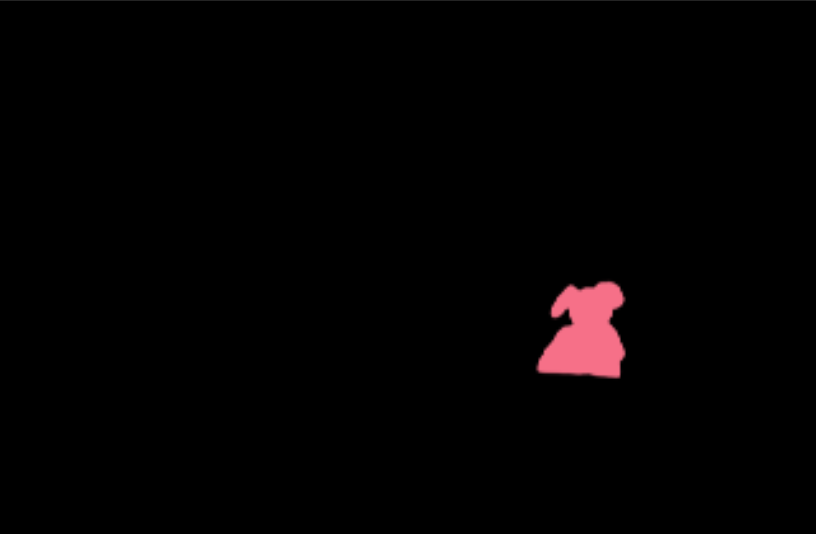
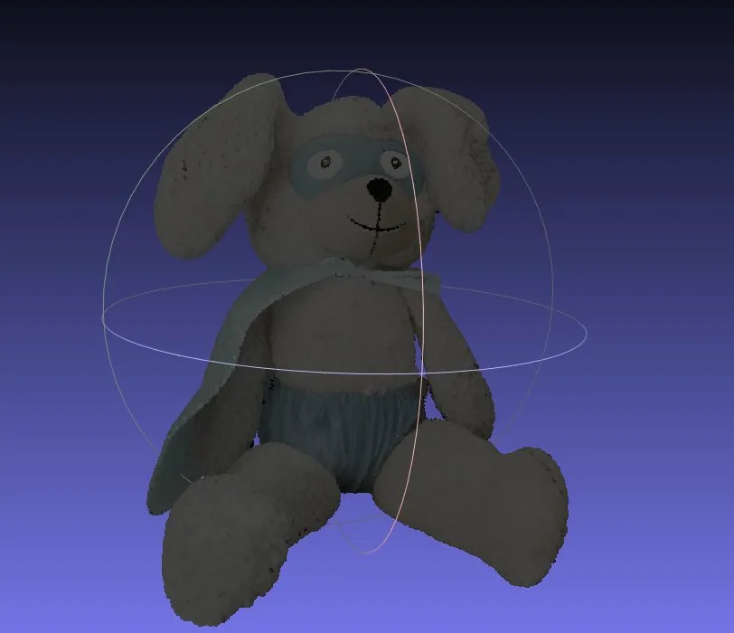
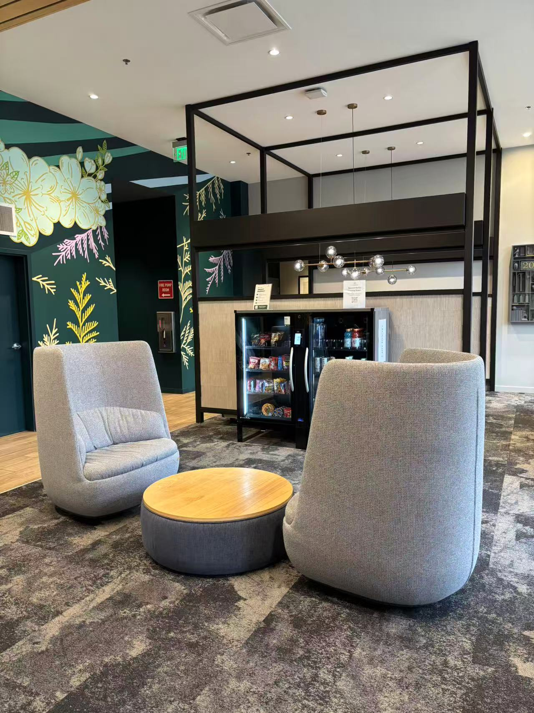
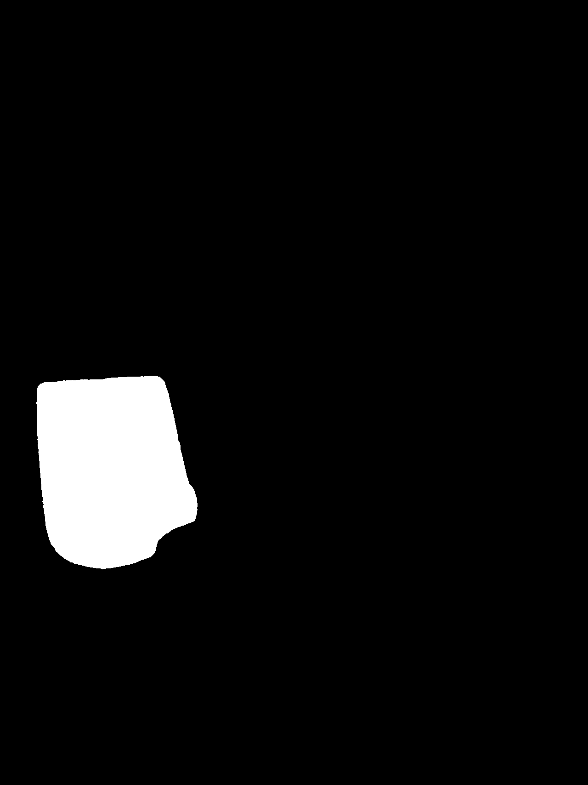
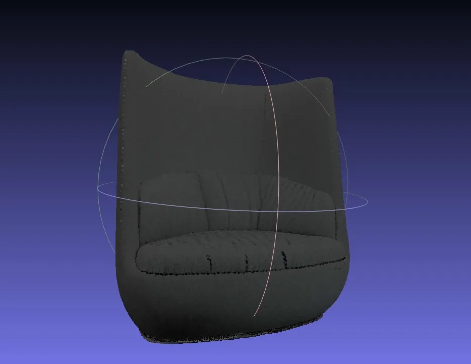
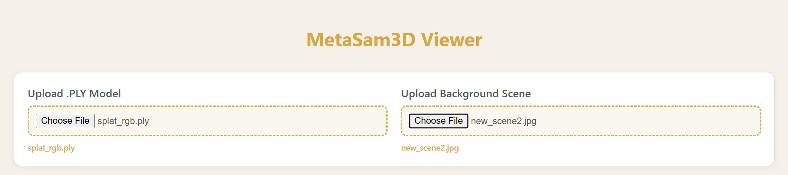
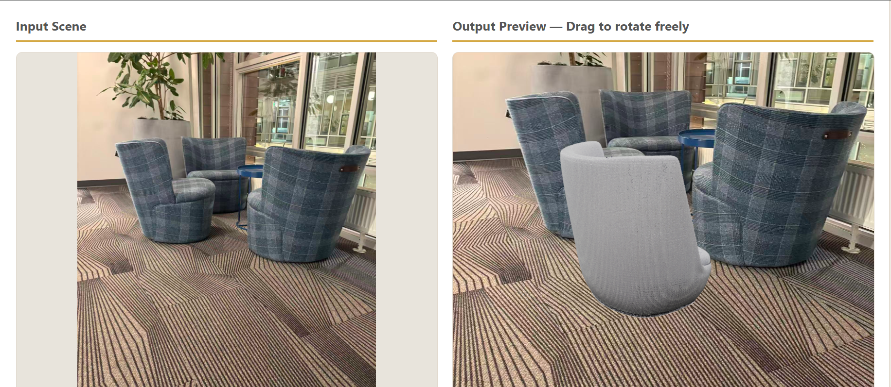
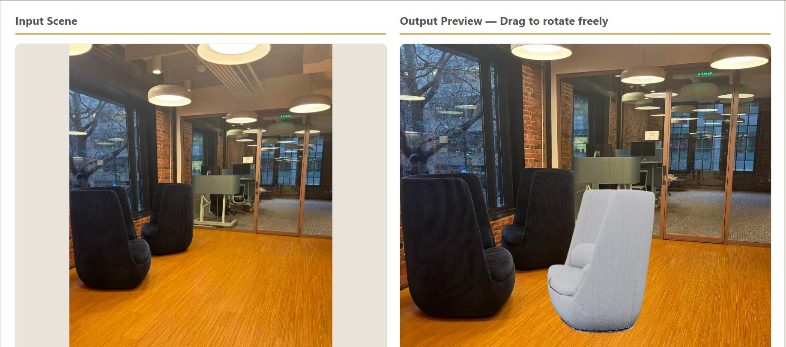
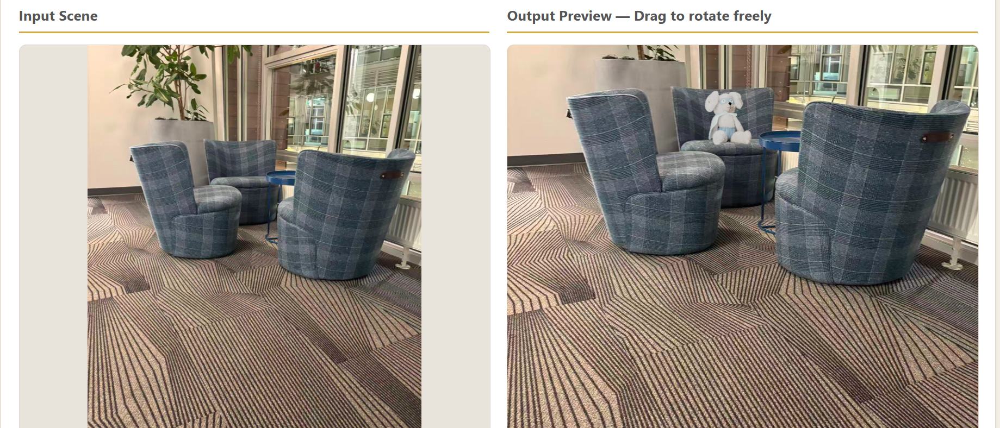
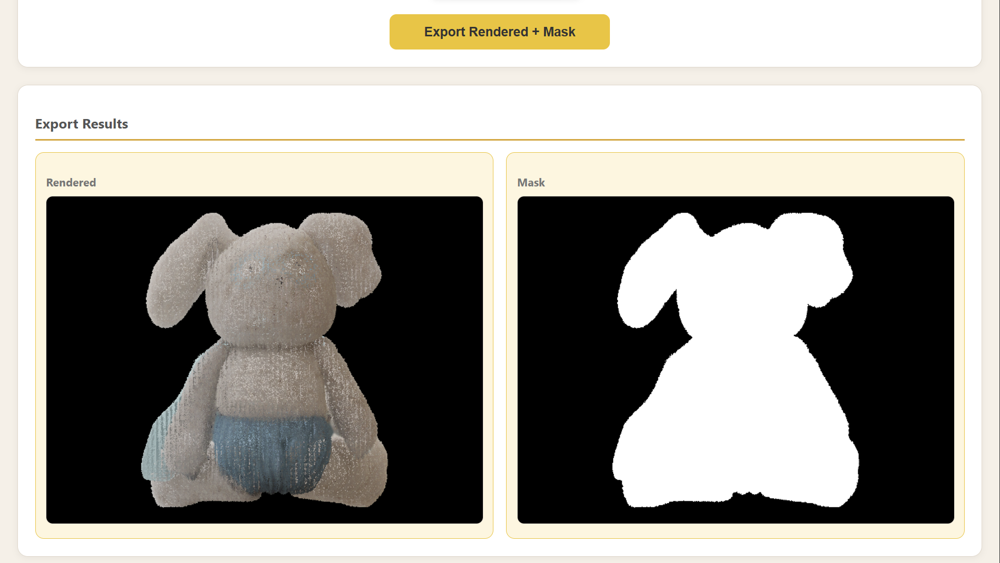

# Segment2Scene3D

A single-image 3D reconstruction pipeline built on Meta's SAM2 and SAM3D. Users click on any object in a photo — the pipeline segments it, reconstructs a full 3D model, and places it into new scenes through an interactive web UI.

---

## 3D Reconstruction Demo

### Example 1 — Stuffed Rabbit (SAM3D official sample image)

<table>
  <tr>
    <th align="center">Input Image</th>
    <th align="center">SAM2 Mask</th>
    <th align="center">3D Reconstruction</th>
  </tr>
  <tr>
    <td align="center"></td>
    <td align="center"></td>
    <td align="center"></td>
  </tr>
</table>

### Example 2 — Lounge Chair (custom image)

<table>
  <tr>
    <th align="center">Input Image</th>
    <th align="center">SAM2 Mask</th>
    <th align="center">3D Reconstruction</th>
  </tr>
  <tr>
    <td align="center"></td>
    <td align="center"></td>
    <td align="center"></td>
  </tr>
</table>

---

## Pipeline Overview

```
Photo
  │
  ▼
[Step 1] SAM2 Click Segmentation        (HPC · sharing partition · GPU a5000)
         User clicks on object → binary mask exported
  │
  ▼
[Step 2] SAM3D 3D Reconstruction        (HPC · gpu partition · GPU required)
         image + mask → flow matching → full 3D shape + texture → .ply
  │
  ▼
[Step 3] Color Conversion
         convert_color.py (SH → RGB) → viewable .ply
  │
  ▼
[Step 4] Web UI — Scene Composition      (Local · Flask + React + Three.js)
         Load .ply → drag to position → rotate freely → export rendered + mask
```

---

## Key Technical Insight

SAM3D takes the mask as the **alpha channel of an RGBA image** — not as a separate input. This means even if the mask has occluded regions, SAM3D still reconstructs a complete 3D object.

**How occlusion completion works:**
- Stage 1 (Geometry): A 1.2B flow matching Transformer samples a full 3D voxel grid from noise, conditioned on DINOv2 image features. Missing geometry is inferred from learned 3D priors — not from the image pixels.
- Stage 2 (Texture): A 600M sparse latent Transformer assigns texture to every voxel, including occluded ones. The Depth-VAE back-projects image features only onto visible voxels; hidden regions are filled by the model's prior.

```
RGBA image (mask in alpha channel)
    ├── ss_preprocessor (with pointmap) → Stage 1: ss_generator → voxel coords
    └── slat_preprocessor              → Stage 2: slat_generator → sparse latent
                                                        ↓
                                              slat_decoder_gs → Gaussian splat
                                              slat_decoder_mesh → polygon mesh
                                                        ↓
                                                   .ply / .glb
```
---
## Web UI Demo

<!-- Replace with your recorded GIF -->


### Screenshots

<p align="center"></p>
<p align="center"><em>Upload interface — load a .PLY model and background scene</em></p>

<p align="center"></p>
<p align="center"><em>Place reconstructed chair into a new lounge scene</em></p>

<p align="center"></p>
<p align="center"><em>Freely adjust scale and position within the scene</em></p>

<p align="center"></p>
<p align="center"><em>Test with a different item in the scene</em></p>

<p align="center"></p>
<p align="center"><em>Export rendered image and clean mask</em></p>

---

## Repo Structure

```
Segment2Scene3D/
├── sam2/
│   └── sam2_click_segment.py     # Click-based segmentation with undo/clear/save
├── sam3d/
│   └── sam3d_reconstruct.ipynb   # SAM3D inference notebook
├── utils/
│   └── convert_color.py          # Spherical harmonics → RGB for MeshLab
├── web_ui/
│   ├── backend/
│   │   └── app.py                # Flask API — rotation, rendering, mask generation
│   └── frontend/
│       ├── src/
│       │   ├── App.js            # React + Three.js viewer with drag & rotate
│       │   └── App.css           # Warm-tone UI styling
│       └── package.json
├── results/
│   ├── input.jpg
│   ├── mask.png
│   └── meshlab_preview.png
└── README.md
```

---

## How to Run

> **Note:** HPC paths below are specific to the Northeastern University Explorer cluster. Adjust paths according to your own cluster setup.

### Step 1 — SAM2 Segmentation (HPC OOD JupyterLab)

**HPC config:**
- Conda Environment: `sam2`
- Workdir: `/home/chen.yijie2/sam2`
- Partition: `sharing` · GPU: `a5000` · GPUs: `1` · CPUs: `4` · Memory: `32GB`

```bash
# Upload your image to:
/home/chen.yijie2/sam2/notebooks/images/
```

Open `sam2/sam2_click_segment.py` in JupyterLab, run all cells.
- Left-click on the object to segment
- **Undo Last** to remove the previous click
- **Clear All** to start over
- **Save Mask** to export `*_mask.png`

---

### Step 2 — SAM3D Reconstruction (HPC OOD JupyterLab)

**HPC config:**
- Conda Environment: `sam3d-objects`
- Workdir: `/projects/digit3d/chen.yijie2-sam3d/sam-3d-objects/notebook`
- Partition: `gpu` · GPUs: `1`

```bash
# Copy image and mask into SAM3D image folder:
mkdir -p .../notebook/images/my_object
cp image.png .../notebook/images/my_object/image.png
cp mask.png   .../notebook/images/my_object/0.png     # must be named 0.png
```

Open `sam3d/sam3d_reconstruct.ipynb`, run all cells. Output: `chair_3d.ply`

---

### Step 3 — Color Conversion (Local)

```bash
python utils/convert_color.py chair_3d.ply chair_3d_rgb.ply
```

---

### Step 4 — Web UI (Local)

**Prerequisites:** Python 3.x with Flask, Node.js 18+

```bash
# Install backend dependencies
pip install flask flask-cors open3d opencv-python numpy Pillow

# Start backend (Terminal 1)
cd web_ui
python backend/app.py
# → Running on http://127.0.0.1:5000

# Install frontend dependencies (first time only)
cd web_ui/frontend
npm install

# Start frontend (Terminal 2)
cd web_ui/frontend
npm start
# → Running on http://localhost:3000
```

**Usage:**
1. Upload a `.ply` model (e.g. `chair_3d_rgb.ply`)
2. Upload a background scene image
3. **Left-drag** to move the object
4. **Right-drag** to rotate the object freely
5. **Scroll** to zoom in/out
6. Click **Export Rendered + Mask** to generate outputs

---

## Environment

| Component | Environment | Key deps |
|-----------|-------------|----------|
| SAM2 | `sam2` conda env (HPC) | `torch`, `sam2`, `ipywidgets` |
| SAM3D | `sam3d-objects` conda env (HPC) | `torch`, `pytorch3d`, `hydra`, `kaolin` |
| Color convert | local Python | `plyfile`, `numpy` |
| Web UI backend | local Python | `flask`, `open3d`, `opencv-python`, `numpy` |
| Web UI frontend | local Node.js | `react`, `three`, `@react-three/fiber`, `axios` |

---

## Acknowledgements

- [Meta SAM2](https://github.com/facebookresearch/sam2)
- [Meta SAM3D Objects](https://github.com/facebookresearch/sam-3d-objects)
- Northeastern University HPC Explorer cluster
